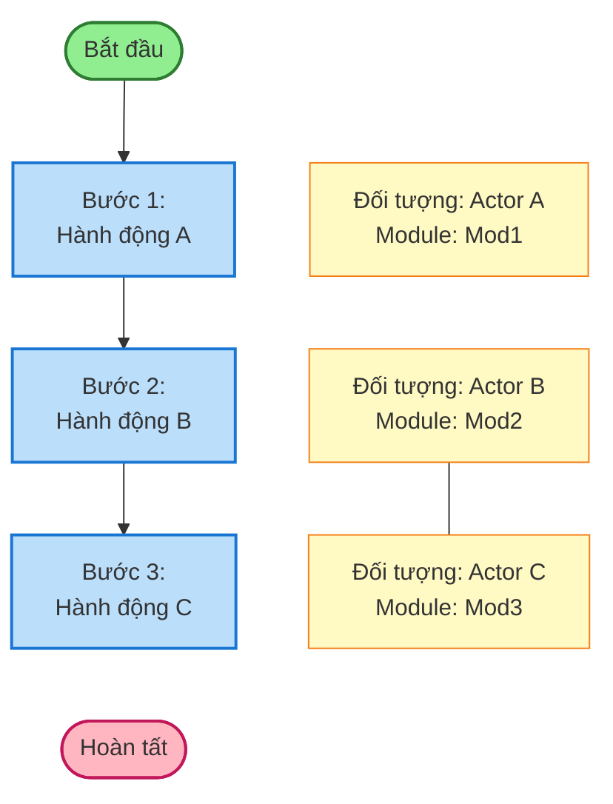
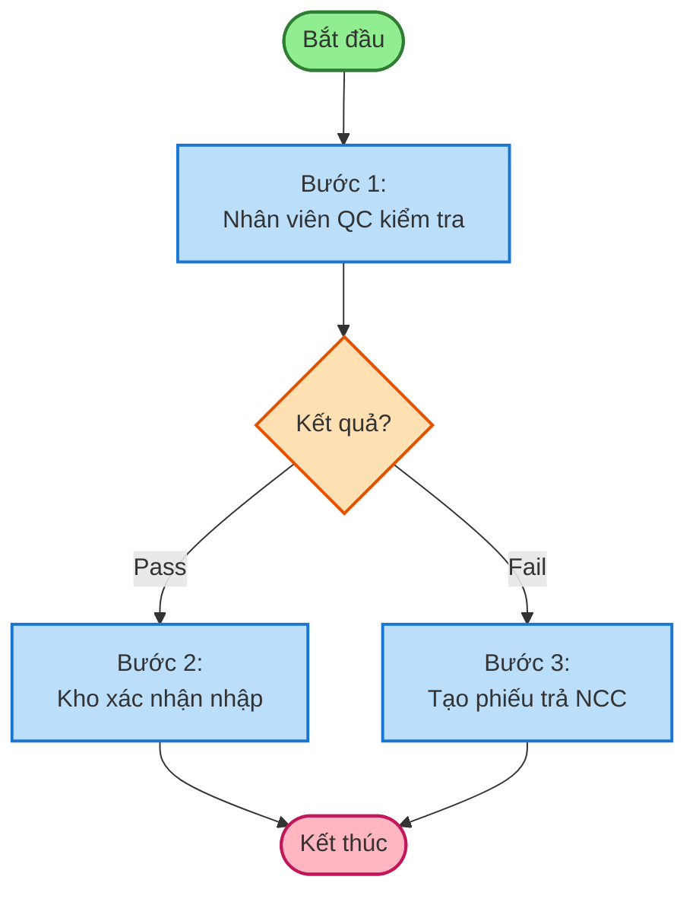
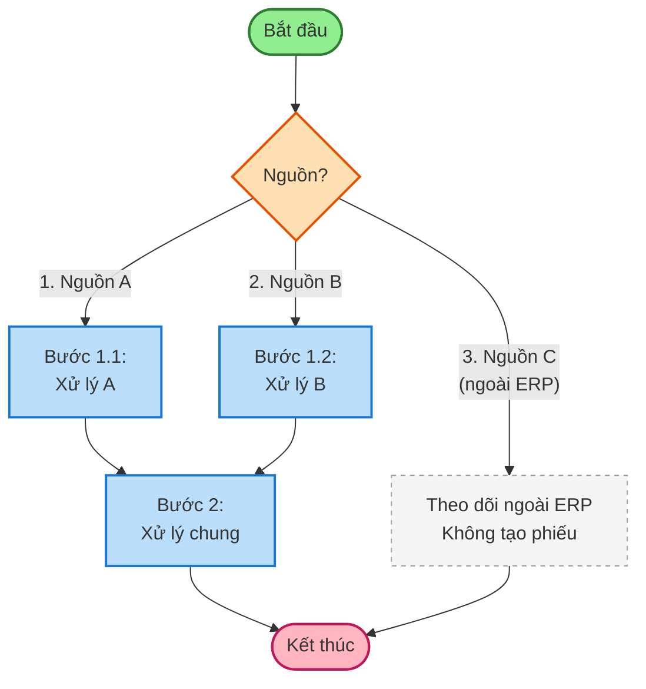
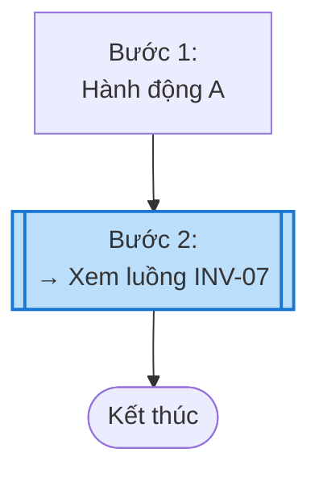
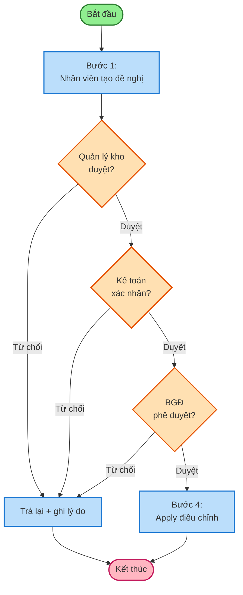

# Mermaid Patterns – BRD Kho SPS

## Pattern 1: Luồng tuyến tính (Linear flow)
*Dùng cho: INV-01 (setup nhân sự), INV-09 (kiểm kê)*

## Pattern 2: Có QC pass/fail (Decision + 2 nhánh)
*Dùng cho: nhập kho có IQC, PQC*

## Pattern 3: Multi-source (nhiều nguồn vào 1 luồng chung)
*Dùng cho: INV-03 nhập kho (5 nguồn), INV-04 xuất kho*

## Pattern 4: Subprocess (tham chiếu luồng khác)
*Dùng khi một bước dẫn sang module khác*

## Pattern 5: Phê duyệt nhiều cấp (Approval workflow)
*Dùng cho: điều chỉnh tồn kho, xuất hủy*

## Lỗi thường gặp khi viết Mermaid

| Lỗi | Nguyên nhân | Fix |
|-----|------------|-----|
| Diagram không render | Ký tự `(`, `)`, `[`, `]` trong label mà không quote | Bọc label bằng `"..."` |
| `linkStyle` sai index | Đếm nhầm thứ tự arrow | Đếm từ 0, theo thứ tự khai báo `-->` |
| Node ID trùng | Dùng cùng ID cho 2 node | Đổi tên ID (không phải label) |
| Edge label xuống dòng không hiện | Dùng `\n` trong label không có quote | Bọc `"text\ntext"` |
| Annotation hiện mũi tên | Quên khai báo `linkStyle ... stroke:transparent` | Tính đúng index các link transparent |
| `stroke-dasharray` không nhận | Thiếu `stroke-width` trước | Luôn khai báo cả hai |
