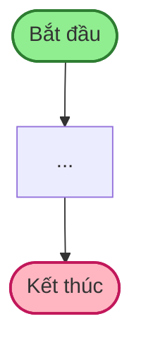

# Mermaid Style Guide – BRD Kho SPS

## Loại node & màu sắc

| Loại | Cú pháp Mermaid | Fill | Stroke | Dùng khi |
|------|----------------|------|--------|---------|
| **Start** | `ID([Bắt đầu])` | `#90EE90` | `#2E7D32` | Điểm bắt đầu luồng |
| **End** | `ID([Kết thúc])` | `#FFB6C1` | `#C2185B` | Điểm kết thúc (có thể nhiều) |
| **Decision** | `ID{Câu hỏi?}` | `#FFE0B2` | `#E65100` | Điều kiện rẽ nhánh |
| **Process** | `ID["Bước N:<br/>Mô tả"]` | `#BBDEFB` | `#1976D2` | Bước xử lý thông thường |
| **Subprocess** | `ID[["Bước N:<br/>Luồng X"]]` | `#BBDEFB` | `#1976D2` | Tham chiếu sang luồng khác |
| **Special** | `ID["text"]` | `#E1BEE7` | `#7B1FA2` | Hàng ký gửi, exception đặc biệt |
| **Out-of-scope** | `ID["text"]` | `#F5F5F5` | `#9E9E9E` | Ngoài ERP, xử lý thủ công |
| **Note/Annotation** | `noteN[text]` | `#FFF9C4` | `#F57F17` | Actor + Module của từng bước |

**Out-of-scope** thêm `stroke-dasharray:4` để tạo đường đứt nét.

## Cú pháp style block

```mermaid
style ID fill:#BBDEFB,stroke:#1976D2,stroke-width:2px
style ID fill:#F5F5F5,stroke:#9E9E9E,stroke-width:1px,stroke-dasharray:4
```

## Pattern: Annotation (Actor + Module)

Annotation nối với step bằng link transparent — KHÔNG hiển thị mũi tên:

```mermaid
flowchart TD
    Step1["Bước 1: ..."] --> Step2["Bước 2: ..."]
    
    note1["Đối tượng: Admin IT<br/>Module: Employees"]
    note2["Đối tượng: Thủ kho<br/>Module: Inventory"]
    
    %% Cột annotation — nối transparent
    noteAnchor --- note1 --- note2
    
    style noteAnchor fill:#fff,fill-opacity:0,stroke:#fff,stroke-opacity:0,color:transparent
    linkStyle [idx_start],[idx_end] stroke:transparent,stroke-width:1px
```

**Lưu ý quan trọng**: `linkStyle` cần đúng index (đếm từ 0 theo thứ tự khai báo arrow `-->`).

## Pattern: Multi-source từ 1 diamond

```mermaid
Source{Nguồn nhập?}
Source -->|"1. NVL từ NCC"| Path1[...]
Source -->|"2. TP từ Sản xuất"| Path2[...]
Source -->|"3. Nội bộ"| Path3[...]
```

## Pattern: Edge label nhiều dòng

```mermaid
-->|"Nhập khẩu\n(hàng lỗi)"| Node
```

## Quy ước đặt tên node

| Loại | Pattern ID | Ví dụ |
|------|-----------|-------|
| Start/End | `Start`, `End`, `End1`, `End2` | `End3` |
| Decision | `TênCụm{...}` | `Source`, `QCResult`, `TypePO` |
| Bước | `TênCụm["Bước N:..."]` | `PO`, `ValidateNVL`, `QCCheck` |
| Subprocess | `TênCụm[["Bước N: Luồng..."]]` | `TT`, `NVLND` |
| Note | `noteN[...]` + anchor `note00` | `note1`, `note2` |

## Quy ước nội dung node

```
"Bước N:<br/>Tên hành động<br/>chi tiết nếu cần"
```

- Dùng `<br/>` để xuống dòng trong node
- Bước có số (`Bước 1:`, `Bước 2.1:`, `Bước 10:`)
- Decision KHÔNG có số bước

## Luồng header chuẩn


